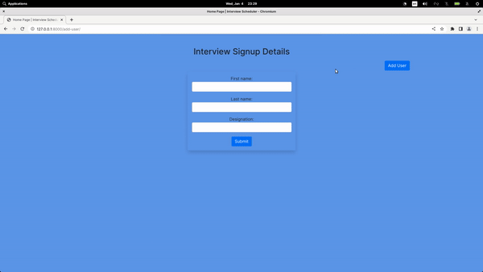

# About

CRUD project




* Run the project

1. create virtual env
2. 
```
python manage.py runserver
```
3. visit 127.0.0.1:8000 in browser

##### Reproduce the project via following steps
1. Create a virtual env 
```
virtualenv venv
source ./venv/bin/activate
```
2.Create a project named interview_app
```
django-admin startproject interview_app
```
3. Create an app named test_app inside it
```
cd interview_appls
django-admin startapp testapp
```
4. Modify testapp in INSTALLED_APPS of settings.py
5. Convert django models into tables via makemigrations and migrate
```
python manage.py makemigrations
python manage.py migrate
```
6. Create a superuser inside it
```
python manage.py createsuperuser
admin - user
pass - password@123
```
7.  Run server and login into the admin panel using credentials
```
python manage.py runserver
127.0.0.1:8000/admin
```
8. Inside app named interview_app create static and template folders. 
inside static - css and js
cs - style.css
inside templates - src - base.html - create a base template which will be extended via bootstrap
 
 9. Copy the bootstrap starter template from https://getbootstrap.com/docs/5.0/getting-started/introduction/ into base.html - 

 10. Create block statement in head and body

 11. Create a view to render from interview_app's view.py and render index.html which in turn extends base.html

 12. Create a urls.py in the interview_app and url patterns which in turn will be reflected at the urls.py at project level

 13. Create an index.html file which extends base.html and accordingly use bootstrap tables, button by searching table on bootstrap5 page and copying a sample

 14. Go inside interview_app and create table inside models.py,once done make migrations and migrate by running the following commmands to make a sqlite db table
 ```
 python manage.py makemigrations
 python manage.py migrate
 python manage.py runserver
 ```

 15. Add some data by admin and show it in table by default to be displayed in models by tweaking admin.py 
```
# add data
python manage.py runserver
127.0.0.1/admin
```
16. Inside views.py import model and render the data in table by making changes in views.py and index.html by removing all sample entries

17. Now, to create the functionality of add user create a method in view and thus a add_user.html which will extend it. Define its import in app level urls.py too and add href in index.html

18. Create a forms.py to take in app level and import this form after appending required methods in views.py. Make changes to make form visible in add_user.html. Add buttons to submit and add bootstrap to the form. 


