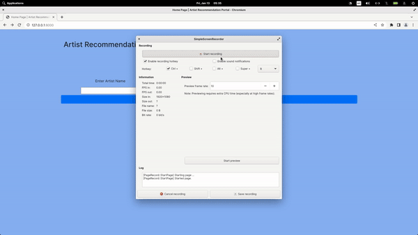

#### About
Music recommendation system on Spotify dataset via Django. We'll train a model using Collborative filter technique and host it via Django. 

Spotify dataset.
Link - https://www.kaggle.com/datasets/vatsalmavani/spotify-dataset

#### General information about recommendation systems.
It is used to suggest what a user should consume on a platform next. It is mostly used to increase profitability of a platform hosted on the internet that contains millions of discrete content awaiting to be consumed.

In this we'll develop a collaborative filtering based recommendation system, Where user-rating on a definite scale is used to build the future suggestions.

* Types of recommendation system

Link - https://www.engati.com/glossary/recommendation-systems

* Building Collaborative Filter based Recommendation System
1. Perform exploratory data analysis of the data. Refer notebook.ipynb in notebook directory at root level of the project.
2. Build the collaborative filter as illustrated in notebook.ipynb
3. Export the similarity scores, table of userid-rating and pruned dataframe as pkl for processing it in the Django Web app.

##### Steps.
1. Create a virtual env and activate it
``` 
virtualenv music_env
source ./music_env/bin/activate
```
2. Install Django. Pandas via pip inside the environment & Start a project music_recommendation and music_app
```
django-admin startproject music_recommendation
cd music_recommendation
django-admin startapp music_app
```
3. Add music_app in INSTALLED_APPS of settings.py
4. Create static and templates directory inside the music_app under which create css/style.css, images and templates/src/index.html nested files. Ensure base.html is also created from bootstrap.
5. Create view to render the index.html, then Create urls.py to render the view and quote it in project level urls.py
6. Copy and paste the function of recommendation from notebook along with its data in views.py
7. run the command and predict
```
python manage.py runserver
```
Demo Link- 127.0.0.1:8000


